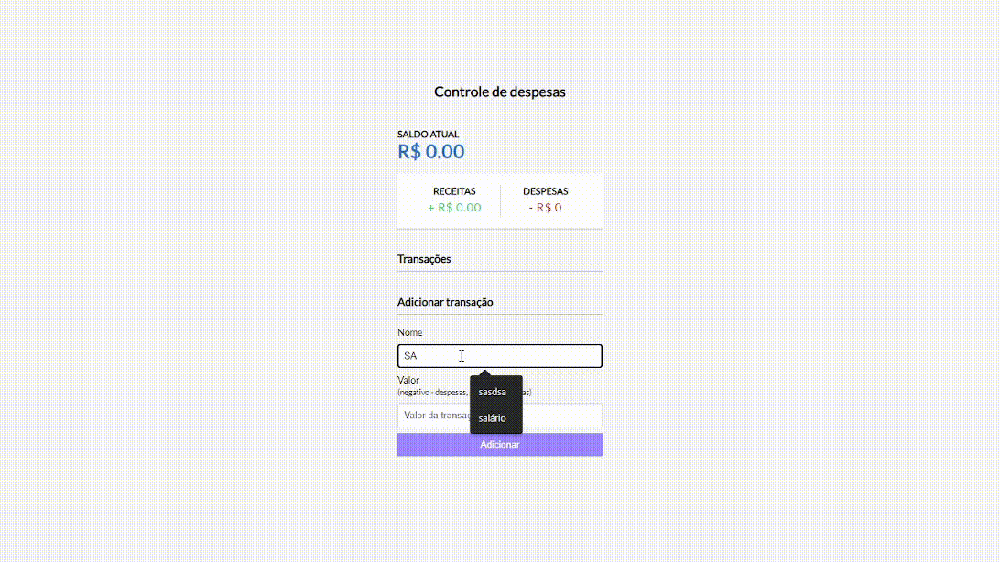

# Controle financeiro

[DEPLOY](https://levi-martins.github.io/controle-financeiro/)

Esse projeto desenvolvovido com o intuito de organizar o controle financeiro de gastos e lucros

Para salvar os dados foi usado [localStorage](https://developer.mozilla.org/en-US/docs/Web/API/Window/localStorage)